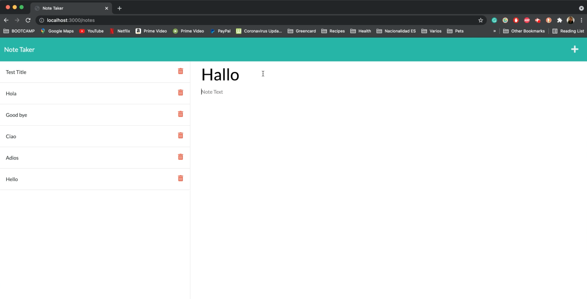

# Note Taker

# Description

The app allows the user to: 
* Add new notes
* Save notes to local storage 
* The user can delete notes

## Deployed App link 

https://atitlan-note-taker.herokuapp.com/

## Screenshot of Note Taker

## Demo of the App

(Click on the image below to be redirected to the Youtube demo video)

# Table of Contents

* [Installation](#installation)
    
* [Usage](#usage)

* [Technology](#technology)

* [License](#license)

* [Contributors](#contributors)

* [Questions](#questions)

# Installation

Visit the deployed app to take notes: https://atitlan-note-taker.herokuapp.com/

# Usage

This app allows the user to take notes, save them and delete them. 

# Technology

* Express 
* NodeJs

# License 

This project is governed by: MIT License

# Contributors

Blenda Orellana

# Questions

If you have any questions about the repo or the app please feel free to contact me
 * Email: blen.or90@gmail.com
 * Github: https://github.com/blen90
